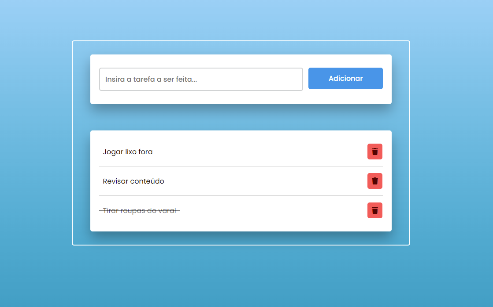

# 📝 To Do List

A simple To Do List built in HTML, CSS and JavaScript.

## Features

- Add tasks using the input field and button or Enter key.
- Click the item text to mark it as done;
- Click the **Trash Bin Icon** to delete the item.
- The items are stored and you can close the window. When you return, the data will be retrieved.

This application uses localStorage, saving data across browser sessions. [Try it!](https://akanai-br.github.io/To-Do-List/)

## Screenshot

